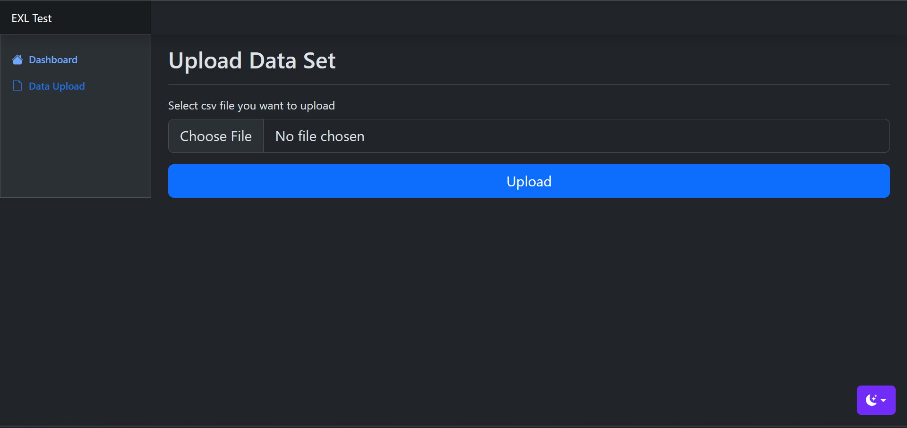
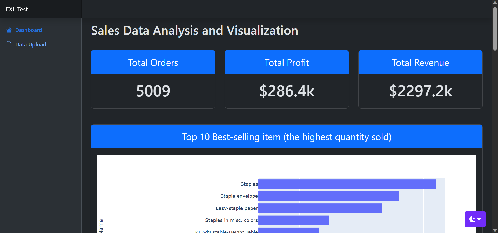
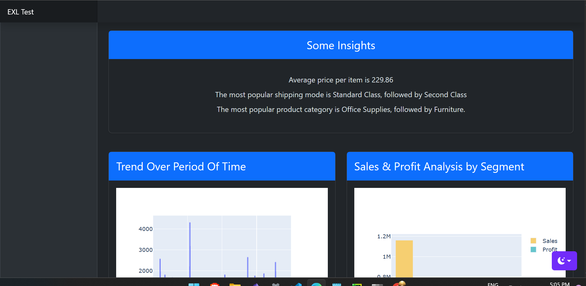
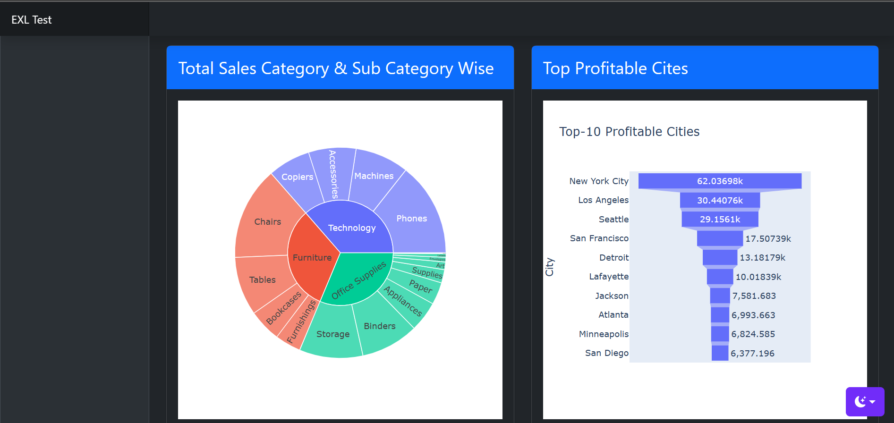

# Sales Data Analysis and Visualization application
### Sales Data Analysis and Visualization application developed using flask backend and bootstrap frontend.
## Steps to run the application in local
1) Clone this repo and navigate to analysis folder
2) Create a virtual env and install all the dependency from the requirements.txt
3) Activate the virtual env and run `python app.py`
4) click on the link `http://127.0.0.1:8000/`

Screenshots
File upload Screen

Click on Chose file and upload the super store csv file. **If there is no dataset then Dashboard will not open.** To see the dashboard you have to upload the dataset first

